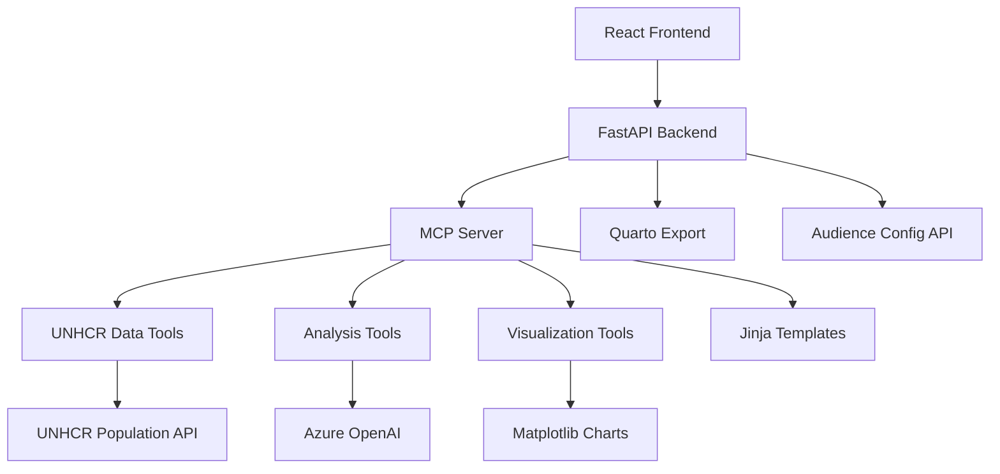
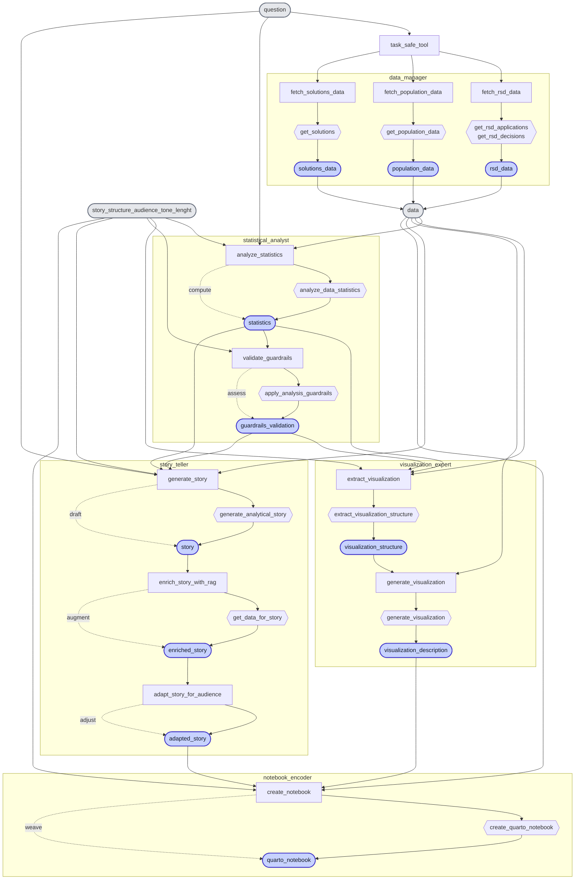
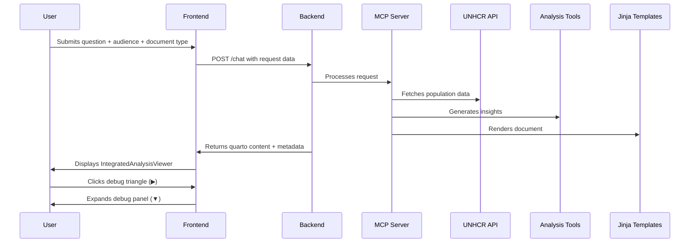

# UNHCR Statistics Copilot: LLM+ MCP + Stat API + Quarto

**AI-Powered Data Analysis Platform for UNHCR Population Statistics**

For non technical person, you may review the [Terms of Reference and Standard Operating Procedure for UNHCR Statistics Copilot Virtual Assistant](terms_of_reference_and_sop_unhcr.md).

The below documentation is for technical person. This app app offer a single Azure App Service deployment hosting FastAPI, MCP server, React UI, Azure OpenAI integration hooks, Charts and Quarto export with audience-specific document type configuration.

## Quick Start

```bash
# Fill env variables in .env file within backend/ folder

# Start the development server
./start.sh

# Access the application at http://localhost:5173/
```

## Architecture Overview



## Agentic Orchestration




## Typical Analysis Request Flow



## Core Features

### 1. **Audience-Specific Document Type Configuration**

The system supports different audience types with specific document type mappings:

For up-to-date audience-specific document type mappings and defaults, use the `/analysis-config` API endpoint:

```bash
# GET /analysis-config
# GET /analysis-config/{audience}
```

Each document type has specific configuration including:
- **Tone and Style**: Formal, engaging, strategic, etc.
- **Length Specifications**: Word range, reading time, content density
- **Recommended Structure**: Section breakdown for the document

### 2. **Jinja Template System**

Document-specific Jinja templates for consistent formatting:

- **Base Template**: `base_quarto.j2` - Common structure and metadata
- **Technical Report**: `technical_report.j2` - Formal, structured reports
- **Executive Summary**: `executive_summary.j2` - Concise, action-oriented
- **Long Read**: `long_read.j2` - Comprehensive analytical reports
- **Social Media**: `social_media.j2` - Short, engaging posts
- **LinkedIn Post**: `linkedin_post.j2` - Professional content

### 3. **Data Analysis Workflow**

- **Natural Language Queries**: Ask questions like "Show refugee trends in France"
- **Automatic Tool Selection**: AI chooses the right data tools
- **Multi-Stage Analysis**: Data fetching → Statistical analysis → Visualization → Narrative generation
- **Methodology Guardrails**: Ensures UNHCR compliance
- **Audience-Specific Output**: Results tailored to selected audience type

### 4. **Available MCP Tools**

#### Data Fetching Tools
- `get_country_key_figures(coa, year, population_types)` - Key statistics for a country
- `get_population_trends(coa, years, population_types)` - Time series data
- `get_demographic_breakdown(coa, year)` - Age/gender distribution

#### Analysis Tools  
- `analyze_data_statistics(data)` - Statistical analysis
- `extract_visualization_structure(data)` - Chart recommendations
- `generate_ai_data_story(visualization_data)` - Narrative generation

#### Export Tools
- `create_quarto_notebook(story_content)` - Reproducible reports with Jinja templates
- `generate_visualization(chart_data)` - Accessible descriptions


## 🔧 API Endpoints

### Core Endpoints

| Endpoint | Method | Description | Response Format |
|----------|--------|-------------|----------------|
| `/chat` | POST | Process natural language queries | Analysis result with metadata |
| `/tool` | POST | Execute specific tools | Tool execution result |
| `/story` | POST | Generate data stories | Narrative story content |
| `/chart` | POST | Generate visualizations | Chart data and metadata |
| `/analysis-config` | GET | Get complete configuration | Full ANALYSIS_CONFIG |
| `/analysis-config/{audience}` | GET | Get audience-specific config | Audience-specific config |
| `/health` | GET | Health check | `{"status": "ok"}` |

### Configuration Endpoints

| Endpoint | Method | Description | Example Response |
|----------|--------|-------------|----------------|
| `/analysis-config` | GET | Get complete configuration | `{"config": {...all audiences and types...}}` |
| `/analysis-config/{audience}` | GET | Get audience-specific config | `{"available_document_types": [...], "default_document_type": "..."}` |


## Error Handling

The system includes comprehensive error handling:

- **Input Validation**: All endpoints validate required parameters
- **Tool Error Handling**: Graceful degradation when tools fail
- **Guardrails**: Methodology compliance checking
- **Fallback Mechanisms**: Alternative approaches when primary methods fail
- **Template Fallbacks**: Base template used when specific template not found
- **Audience Validation**: Automatic fallback to "internal" for unknown audiences
- **Document Type Validation**: Automatic switch to default when invalid type selected


## Contributing

For issues and questions, please use the GitHub issue tracker.

For Development:

1. Fork the repository
2. Create a feature branch: `git checkout -b feature/your-feature`
3. Commit changes: `git commit -m 'Add some feature'`
4. Push to branch: `git push origin feature/your-feature`
5. Open a pull request

Contribution Guidelines:

- Follow existing code style and patterns
- Add tests for new features
- Update documentation as needed
- Ensure backward compatibility
- Consider all audience types in changes


Features Ideas:

- **Additional Audience Types**: NGO, academic, general public
- **More Document Types**: Infographics, presentations, video scripts
- **Template Editor**: UI for creating/customizing templates
- **Configuration UI**: Admin interface for managing settings
- **Usage Analytics**: Dashboard for monitoring and insights

Potential Integrations:

- **Additional Data Sources**: World Bank, UNHCR reports, etc.
- **Export Formats**: PDF, PowerPoint, Word
- **Collaboration Tools**: Microsoft 365
- **Translation Services**: Multilingual support
- **Accessibility Tools**: Screen reader optimization

Research Directions:

- **Audience Analysis**: Impact of different configurations
- **Template Effectiveness**: Which structures work best
- **User Behavior**: How different audiences interact
- **Performance Optimization**: Faster rendering and processing
- **AI Improvements**: Better tool selection and content generation

## License

[MIT License](LICENSE) - Copyright (c) 2024 UNHCR

