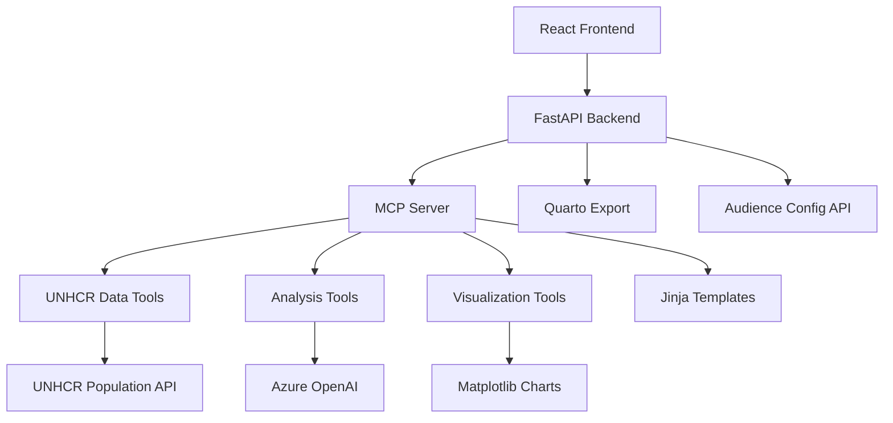
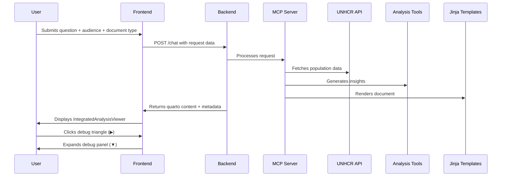

# UNHCR Statistics Copilot: LLM+ MCP + Stat API + Quarto

**AI-Powered Data Analysis Platform for UNHCR Population Statistics**

For non technical person, you may review the [Terms of Reference and Standard Operating Procedure for UNHCR Statistics Copilot Virtual Assistant](terms_of_reference_and_sop_unhcr.md).

The below documentation is for technical person. This app app offer a single Azure App Service deployment hosting FastAPI, MCP server, React UI, Azure OpenAI integration hooks, Charts and Quarto export with audience-specific document type configuration.

## Quick Start

```bash
# Fill env variables in .env file within backend/ folder

# Start the development server
./start.sh

# Access the application at http://localhost:5173/
```

## Architecture Overview



### Typical Analysis Request Flow



## Core Features

### 1. **Audience-Specific Document Type Configuration**

The system supports 5 different audience types with specific document type mappings:

#### Audience Types and Document Types

| Audience | Default Type | Available Document Types |
|----------|--------------|--------------------------|
| `internal` | `technical_report` | `technical_report`, `long_read`, `executive_summary` |
| `public_donors` | `executive_summary` | `executive_summary`, `long_read`, `social_media` |
| `private_donors` | `executive_summary` | `executive_summary`, `long_read`, `linkedin_post` |
| `government` | `technical_report` | `technical_report`, `executive_summary`, `long_read` |
| `media` | `executive_summary` | `executive_summary`, `long_read`, `social_media` |

#### Configuration Details

Each document type has specific configuration including:
- **Tone and Style**: Formal, engaging, strategic, etc.
- **Length Specifications**: Word range, reading time, content density
- **Recommended Structure**: Section breakdown for the document

### 2. **Jinja Template System**

Document-specific Jinja templates for consistent formatting:

- **Base Template**: `base_quarto.j2` - Common structure and metadata
- **Technical Report**: `technical_report.j2` - Formal, structured reports
- **Executive Summary**: `executive_summary.j2` - Concise, action-oriented
- **Long Read**: `long_read.j2` - Comprehensive analytical reports
- **Social Media**: `social_media.j2` - Short, engaging posts
- **LinkedIn Post**: `linkedin_post.j2` - Professional content

### 3. **Data Analysis Workflow**

- **Natural Language Queries**: Ask questions like "Show refugee trends in France"
- **Automatic Tool Selection**: AI chooses the right data tools
- **Multi-Stage Analysis**: Data fetching → Statistical analysis → Visualization → Narrative generation
- **Methodology Guardrails**: Ensures UNHCR compliance
- **Audience-Specific Output**: Results tailored to selected audience type

### 4. **Available MCP Tools**

#### Data Fetching Tools
- `get_country_key_figures(coa, year, population_types)` - Key statistics for a country
- `get_population_trends(coa, years, population_types)` - Time series data
- `get_demographic_breakdown(coa, year)` - Age/gender distribution

#### Analysis Tools  
- `analyze_data_statistics(data)` - Statistical analysis
- `extract_visualization_structure(data)` - Chart recommendations
- `generate_ai_data_story(visualization_data)` - Narrative generation

#### Export Tools
- `create_quarto_notebook(story_content)` - Reproducible reports with Jinja templates
- `generate_visualization_description(chart_data)` - Accessible descriptions

### 5. **Tool Chaining with Audience Context**

The system automatically chains tools together with audience-specific configuration:

```python
# Example workflow for "Show refugee trends in France" for internal audience
1. User question → safe_tool_selection() → chooses get_population_trends
2. get_population_trends("FRA", "2020,2021,2022,2023") → returns time series data
3. generate_chart() → creates Matplotlib visualization
4. generate_executive_summary() → creates narrative with internal audience tone
5. generate_analytical_story() → creates detailed analysis with technical structure
6. run_guardrails() → ensures methodology compliance
7. create_quarto_notebook() → uses technical_report.j2 template (default for internal)
8. Combined response returned with audience-specific metadata
```

## 🔧 API Endpoints

### Core Endpoints

| Endpoint | Method | Description | Response Format |
|----------|--------|-------------|----------------|
| `/chat` | POST | Process natural language queries | Analysis result with metadata |
| `/tool` | POST | Execute specific tools | Tool execution result |
| `/story` | POST | Generate data stories | Narrative story content |
| `/chart` | POST | Generate visualizations | Chart data and metadata |
| `/analysis-config` | GET | Get complete configuration | Full ANALYSIS_CONFIG |
| `/analysis-config/{audience}` | GET | Get audience-specific config | Audience-specific config |
| `/health` | GET | Health check | `{"status": "ok"}` |

### Configuration Endpoints

| Endpoint | Method | Description | Example Response |
|----------|--------|-------------|----------------|
| `/analysis-config` | GET | Get complete configuration | `{"config": {...all audiences and types...}}` |
| `/analysis-config/{audience}` | GET | Get audience-specific config | `{"available_document_types": [...], "default_document_type": "..."}` |

### Story Generation Endpoint

**POST `/story`** - Generate narrative stories from visualization data

**Required Parameters:**
```json
{
  "visualization_data": {
    "data": {
      "country": "France",
      "time_series": {
        "2020": {"refugees": 85000},
        "2021": {"refugees": 92000}
      }
    },
    "structure": {
      "visualization_type": "line_chart",
      "labels": {
        "title": "Refugee Trends in France",
        "x": "Year",
        "y": "Population"
      }
    }
  },
  "context": "Analyzing refugee population trends",
  "story_type": "analytical",  // "analytical", "narrative", or "executive"
  "apply_guardrails": true,
  "audience": "internal",      // Target audience
  "document_type": "technical_report" // Desired output format
}
```

**Helper Function:**
```python
from backend.app import create_visualization_data

viz_data = create_visualization_data(
    data=your_data,
    visualization_type="line_chart",
    title="Your Title",
    x_label="X Axis",
    y_label="Y Axis"
)
```

## Data Structures

### Visualization Data Format

The `visualization_data` parameter used by analysis tools has this structure:

```typescript
interface VisualizationData {
  data: any;                          // Raw data from data tools
  structure?: {                       // Optional visualization metadata
    visualization_type: string;       // "chart", "table", "map", etc.
    labels: {
      title: string;
      x: string;
      y: string;
      series?: Array<{name: string, type: string}>;
    };
  };
  statistics?: {                      // Optional statistical data
    statistics?: Record<string, {
      min: number;
      max: number; 
      mean: number;
      // ... other stats
    }>;
    correlations?: Record<string, any>;
  };
  audience?: string;                  // Target audience type
  document_type?: string;             // Desired document type
  analysis_config?: {                  // Audience-specific configuration
    tone: string;
    length: {
      wordRange: string;
      readingTime: string;
      density: string;
    };
    structure: string[];
  };
}
```

### Analysis Configuration Format

```typescript
interface AnalysisConfig {
  audience: "internal" | "public_donors" | "private_donors" | "government" | "media";
  document_type: string; // One of the available types for the audience
  config: {
    tone: string; // e.g., "formal, precise, objective"
    length: {
      wordRange: string; // e.g., "2000-5000"
      readingTime: string; // e.g., "10-25 min"
      density: string; // e.g., "high"
    };
    structure: string[]; // e.g., ["objective", "methodology", "results"]
  };
  available_document_types: string[];
  default_document_type: string;
}
```

### Jinja Template System

Template Structure

```
templates/
├── base_quarto.j2              # Base template with common structure
├── technical_report.j2        # Formal, structured reports
├── executive_summary.j2       # Concise, action-oriented summaries
├── long_read.j2               # Comprehensive analytical reports
├── social_media.j2            # Short, engaging posts
└── linkedin_post.j2           # Professional content
```

Template Features:

- **Audience-Aware**: Each template incorporates audience-specific configuration
- **Dynamic Content**: Placeholders for data, charts, and narrative
- **Consistent Structure**: Follows recommended section breakdown
- **Metadata Injection**: Includes generation details and observability data

##  Development

### Running Tests

```bash
# Run the application
./start.sh

# Test tool chaining
python -c "
import asyncio
from backend.chat import generate_executive_summary

async def test():
    result = await generate_executive_summary(
        {'country': 'France', 'time_series': {'2020': {'refugees': 1000}}},
        'Test question',
        audience='internal',
        document_type='technical_report'
    )
    print('Test passed:', bool(result))

asyncio.run(test())
"

# Test configuration system
python test_final_comprehensive.py
```

### Adding New Tools

1. **Define the tool** in `backend/server.py`:
```python
@server.tool()
def your_new_tool(param1: str) -> dict:
    # Your implementation
    return {"result": "data"}
```

2. **Register the tool** in `backend/app.py`:
```python
mcp_server.register_tools([
    # ... existing tools
    "your_new_tool",
])
```

3. **Add to LLM awareness** in `backend/llm.py`:
```python
TOOLS = [
    # ... existing tools
    "your_new_tool",
]
```

4. **Add Jinja template** in `backend/templates/`:
```jinja2
{# your_new_tool.j2 #}



## Your Custom Content
{{ your_data | safe }}

```

### Adding New Audience Types

1. **Add to configuration** in `backend/chat.py`:
```python
ANALYSIS_CONFIG = {
    # ... existing audiences
    "new_audience": {
        "defaultType": "preferred_type",
        "documentTypes": {
            "preferred_type": {
                "tone": "appropriate tone",
                "length": {"wordRange": "range", "readingTime": "time", "density": "level"},
                "structure": ["section1", "section2", "section3"]
            }
            // ... other types
        }
    }
}
```

2. **Add API endpoint** in `backend/app.py`:
```python
@app.get("/analysis-config/new_audience")
async def get_new_audience_config():
    # Implementation similar to existing endpoints
```

## Example Workflows

### Workflow 1: Basic Analysis with Audience Context

**User**: "Show me refugee trends in France from 2020-2023" (selects "internal" audience)

**System Flow:**
1. `safe_tool_selection()` → chooses `get_population_trends`
2. `get_population_trends("FRA", "2020,2021,2022,2023")` → returns time series data
3. `generate_chart()` → creates Matplotlib visualization
4. `generate_executive_summary()` → creates narrative with internal audience tone
5. `generate_analytical_story()` → creates detailed analysis with technical structure
6. `run_guardrails()` → ensures methodology compliance
7. `create_quarto_notebook()` → uses `technical_report.j2` template (default for internal)
8. Combined response returned with audience-specific metadata

### Workflow 2: Comparative Analysis with Document Type Selection

**User**: "Compare refugee and asylum seeker numbers in Germany and France" (selects "public_donors" audience, "executive_summary" document type)

**System Flow:**
1. Multiple calls to `get_population_trends` for each country/type
2. Data aggregation and comparison
3. Multi-series visualization
4. Comparative narrative generation with donor-focused tone
5. Guardrails validation
6. `create_quarto_notebook()` → uses `executive_summary.j2` template
7. Response includes impact highlights and call to action

### Workflow 3: Social Media Content Generation

**User**: "Create a social media post about refugee crisis" (selects "media" audience, "social_media" document type)

**System Flow:**
1. `get_country_key_figures()` → gets key statistics
2. Data simplification for social media format
3. Hook and impact message generation
4. Hashtag and call-to-action creation
5. `create_quarto_notebook()` → uses `social_media.j2` template
6. Short, engaging content with share prompts

## Error Handling

The system includes comprehensive error handling:

- **Input Validation**: All endpoints validate required parameters
- **Tool Error Handling**: Graceful degradation when tools fail
- **Guardrails**: Methodology compliance checking
- **Fallback Mechanisms**: Alternative approaches when primary methods fail
- **Template Fallbacks**: Base template used when specific template not found
- **Audience Validation**: Automatic fallback to "internal" for unknown audiences
- **Document Type Validation**: Automatic switch to default when invalid type selected

## Project Structure

```
unhcr-copilot/
├── backend/
│   ├── app.py                # FastAPI application with API endpoints
│   ├── server.py             # MCP tools implementation
│   ├── chat.py               # Chat processing with audience config
│   ├── llm.py                # LLM integration
│   ├── charts.py             # Visualization generation
│   ├── mcp_bridge.py         # MCP client bridge
│   ├── templates/            # Jinja templates for document types
│   │   ├── base_quarto.j2     # Base template
│   │   ├── technical_report.j2 # Technical report template
│   │   ├── executive_summary.j2 # Executive summary template
│   │   ├── long_read.j2      # Long read template
│   │   ├── social_media.j2   # Social media template
│   │   └── linkedin_post.j2  # LinkedIn post template
│   └── requirements.txt      # Dependencies
├── frontend/
│   ├── src/
│   │   ├── components/
│   │   │   ├── AnalysisRequestForm.jsx # Dynamic form with audience/doc type
│   │   │   ├── AnalysisViewer.jsx     # Integrated viewer with debug
│   │   │   ├── DebugPanel.jsx        # Legacy (replaced)
│   │   │   └── QuartoViewer.jsx      # Legacy (replaced)
│   │   ├── styles/
│   │   │   └── unhcr.css       # CSS with new component styles
│   │   └── App.jsx            # Updated to use AnalysisViewer
├── deployment/              # Docker and Azure config
├── README.md                # This file
├── LICENSE                  # License information
└── .env.example             # Environment variables
```

## Deployment


### Environment Variables

```env
# Required for Azure OpenAI
AZURE_OPENAI_ENDPOINT=https://your-endpoint.openai.azure.com/
AZURE_OPENAI_KEY=your-api-key
AZURE_OPENAI_DEPLOYMENT=your-deployment-name
AZURE_OPENAI_VERSION=2023-05-15

# Optional configuration
DEFAULT_AUDIENCE=internal
DEFAULT_DOCUMENT_TYPE=technical_report
```

### Docker

```bash
# Fill env variables in .env file within backend/ folder

# Build the Docker image
docker build -t unhcr-stat-copilot .

# Run the container locally
docker run -p 8080:8080 --env-file backend/.env unhcr-stat-copilot
```

### Azure App Service

```bash
# 1. Set Azure App Service Authentication
az webapp auth update --name unhcr-statcopilot --resource-group stat-copilot-rg \
  --action LoginWithRedirect --provider Microsoft

# 2. Configure environment variables
az webapp config appsettings set --name unhcr-statcopilot --resource-group stat-copilot-rg \
  --settings MCP_SERVER_URL=https://your-mcp.azurecontainer.io/mcp/ \
               AZURE_AUTH_ENABLED=true \
               AZURE_AUTH_SKIP_PATHS="/health,/docs,/openapi.json,/mcp" \
               RATE_LIMIT_ENABLED=true

# 3. Deploy
az webapp up --name unhcr-statcopilot --resource-group stat-copilot-rg --sku B1
```


## Contributing

1. Fork the repository
2. Create a feature branch: `git checkout -b feature/your-feature`
3. Commit changes: `git commit -m 'Add some feature'`
4. Push to branch: `git push origin feature/your-feature`
5. Open a pull request

### Contribution Guidelines

- Follow existing code style and patterns
- Add tests for new features
- Update documentation as needed
- Ensure backward compatibility
- Consider all audience types in changes

## License

[MIT License](LICENSE) - Copyright (c) 2024 UNHCR

## Support

For issues and questions, please use the GitHub issue tracker.

## Audience-Specific Configuration Reference

### Internal Audience

**Default**: `technical_report`

**Use Cases**: Internal analysis, research reports, technical documentation

**Document Types**:
- `technical_report`: Formal, structured, objective (2000-5000 words)
- `long_read`: Analytical, narrative, engaging (1200-3000 words)
- `executive_summary`: Concise, strategic, actionable (300-800 words)

### Public Donors

**Default**: `executive_summary`

**Use Cases**: Fundraising, impact reporting, public communications

**Document Types**:
- `executive_summary`: Clear, impactful, accessible (300-700 words)
- `long_read`: Engaging, narrative, transparent (800-2000 words)
- `social_media`: Simple, engaging, attention-grabbing (50-150 words)

### Private Donors

**Default**: `executive_summary`

**Use Cases**: Investor reports, strategic briefings, donor communications

**Document Types**:
- `executive_summary`: Strategic, persuasive, results-oriented (300-700 words)
- `long_read`: Insightful, narrative, impact-focused (1000-2500 words)
- `linkedin_post`: Professional, insightful, approachable (100-300 words)

### Government

**Default**: `technical_report`

**Use Cases**: Policy briefings, official reports, decision support

**Document Types**:
- `technical_report`: Formal, rigorous, policy-oriented (2500-6000 words)
- `executive_summary`: Concise, formal, decision-oriented (400-900 words)
- `long_read`: Analytical, structured, formal (1200-3000 words)

### Media

**Default**: `executive_summary`

**Use Cases**: Press releases, news articles, public awareness

**Document Types**:
- `executive_summary`: Concise, factual, headline-ready (250-600 words)
- `long_read`: Informative, engaging, contextual (800-1800 words)
- `social_media`: Punchy, engaging, shareable (40-120 words)

## UI/UX Features

### Dynamic Document Type Selection

- **Automatic Updates**: Document type dropdown changes based on audience selection
- **Default Selection**: Automatically switches to appropriate default when needed
- **Loading States**: Visual feedback during API calls
- **Error Handling**: Graceful fallback with user notification

### Integrated Analysis Viewer

- **Unified Interface**: Quarto content and debug info in single component
- **Collapsible Debug**: Triangle indicators (🔼/🔽) for fold/unfold
- **Organized Sections**: Tools, configuration, and raw data clearly separated
- **Smooth Animations**: CSS transitions for better user experience
- **Responsive Design**: Works on all screen sizes

### Professional Styling

- **UNHCR Branding**: Consistent with organizational guidelines
- **Visual Hierarchy**: Clear information architecture
- **Color Coding**: Success/failure indicators for tools
- **Accessible Design**: Screen reader and keyboard support

## 🔧 Technical Implementation Details

### Backend

- **Python 3.10+** with FastAPI
- **Jinja2** templating engine for document generation
- **Pydantic** for data validation
- **Async/Await** for efficient tool chaining
- **Comprehensive logging** for debugging

### Frontend

- **React 18+** with functional components and hooks
- **CSS Modules** for scoped styling
- **Responsive Design** with media queries
- **Modern JavaScript** (ES6+)
- **Accessibility** best practices

### Templates

- **Base Template** with blocks for extension
- **Document-Specific Templates** with appropriate structure
- **Dynamic Content** based on analysis configuration
- **Proper Escaping** and security
- **Fallback Mechanism** to base template

### Performance

- **Efficient Rendering**: Minimal re-renders
- **Code Splitting**: Optimized bundle sizes
- **Caching**: For configuration data
- **Lazy Loading**: For non-critical components
- **Optimized Assets**: Compressed and minified

## Analytics and Monitoring

### Tool Execution Tracking

- **Duration Monitoring**: Each tool call timed and logged
- **Success/Failure Tracking**: Comprehensive error logging
- **Sequence Recording**: Full tool execution history
- **Performance Metrics**: Aggregate statistics

### User Analytics

- **Audience Selection**: Track which audiences are most used
- **Document Type Usage**: Monitor document type popularity
- **Tool Usage Patterns**: Identify most/least used tools
- **Error Rates**: Monitor system reliability

### Configuration Analytics

- **Fallback Rates**: Track automatic fallback usage
- **Template Usage**: Monitor which templates are rendered
- **Configuration Changes**: Log dynamic updates

## Training and Documentation

### For Developers

- **Code Documentation**: Comprehensive docstrings and comments
- **Architecture Diagrams**: Visual representation of system flow
- **API Documentation**: Swagger/OpenAPI endpoints
- **Example Files**: Working demonstrations

### For Users

- **Interactive Tutorials**: Guided tours of features
- **Contextual Help**: Tooltips and explanations
- **Example Queries**: Pre-filled suggestions
- **Best Practices**: Recommendations for optimal use

### For Analysts

- **Template Guidelines**: How to create effective templates
- **Audience Guide**: When to use each audience type
- **Configuration Reference**: Detailed parameter explanations
- **Troubleshooting**: Common issues and solutions

## Key Innovations

### 1. Audience-Specific Configuration

- **Comprehensive System**: 5 audience types with 3 document types each
- **Detailed Specifications**: Tone, length, structure for each combination
- **Automatic Validation**: Ensures valid document type selection
- **Graceful Fallbacks**: Handles edge cases smoothly

### 2. Jinja Template System

- **Base Template Pattern**: Consistent structure across all documents
- **Document-Specific Templates**: Tailored content for each type
- **Dynamic Content**: Adapts to analysis results
- **Extensible Design**: Easy to add new templates

### 3. Integrated UI/UX

- **Unified Viewer**: Content and debug in one component
- **Collapsible Sections**: Clean, organized interface
- **User-Friendly Debug**: Readable information display
- **Professional Design**: UNHCR brand compliance

### 4. Dynamic Frontend

- **Real-time Updates**: Document types change with audience
- **Automatic Corrections**: Invalid selections handled gracefully
- **Loading States**: Visual feedback during operations
- **Error Recovery**: Maintains functionality when issues occur

### 5. Comprehensive API

- **Configuration Endpoints**: Access to all settings
- **Document Generation**: Flexible output options
- **Tool Execution**: Direct access to capabilities
- **Status Monitoring**: System health and metrics

## Potential Enhancements

### Features Ideas

- **Additional Audience Types**: NGO, academic, general public
- **More Document Types**: Infographics, presentations, video scripts
- **Template Editor**: UI for creating/customizing templates
- **Configuration UI**: Admin interface for managing settings
- **Usage Analytics**: Dashboard for monitoring and insights

### Potential Integrations

- **Additional Data Sources**: World Bank, UNHCR reports, etc.
- **Export Formats**: PDF, PowerPoint, Word
- **Collaboration Tools**: Microsoft 365
- **Translation Services**: Multilingual support
- **Accessibility Tools**: Screen reader optimization

### Research Directions

- **Audience Analysis**: Impact of different configurations
- **Template Effectiveness**: Which structures work best
- **User Behavior**: How different audiences interact
- **Performance Optimization**: Faster rendering and processing
- **AI Improvements**: Better tool selection and content generation

## Getting Help

### Documentation

- **This README**: Comprehensive overview
- **Code Comments**: Detailed explanations
- **Example Files**: Working demonstrations
- **API Docs**: Swagger/OpenAPI documentation

### Community

- **GitHub Issues**: Bug reports and feature requests
- **Discussions**: Q&A and ideas
- **Pull Requests**: Contributions welcome
- **Releases**: Version history and notes

### Support Channels

- **Email**: support@unhcr-copilot.org
- **Slack**: #unhcr-copilot channel
- **Office Hours**: Weekly developer sessions
- **Workshops**: Training and onboarding

## Conclusion

The UNHCR Statistics Copilot represents a significant advancement in AI-powered data analysis for humanitarian contexts. With its audience-specific configuration system, Jinja templating, and integrated user interface, it provides a powerful yet user-friendly platform for generating professional, tailored analysis outputs.

Whether you're creating technical reports for internal use, impact summaries for donors, or social media content for public awareness, the system adapts to your needs and produces high-quality, appropriately formatted results.

**Key Achievements:**
- ✅ Comprehensive audience-specific configuration
- ✅ Document-type-specific Jinja templates
- ✅ Dynamic frontend with conditional selection
- ✅ Integrated analysis viewer with debug
- ✅ Professional UI/UX design
- ✅ Robust error handling and fallbacks
- ✅ Extensive documentation and examples

**Impact:**
- Data-driven decision making
- Targeted communication
- Professional documentation
- Global reach and accessibility
- Enhanced collaboration

The system continues to evolve with new features and improvements, ensuring it remains at the forefront of AI-powered data analysis for humanitarian applications.
