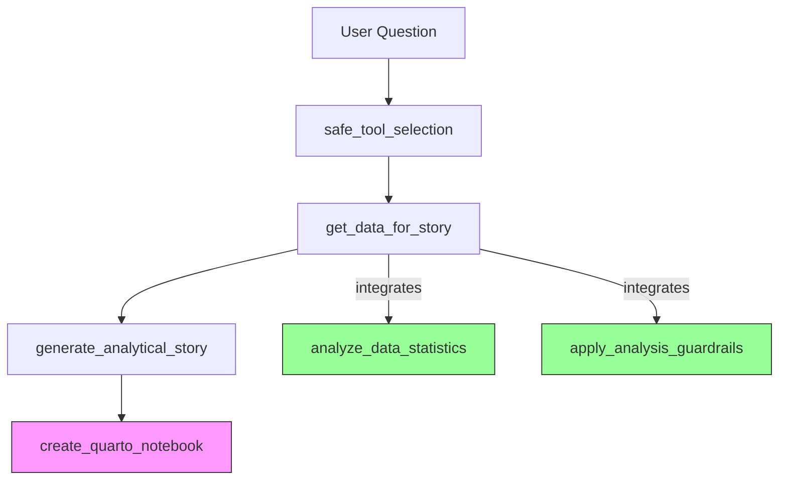
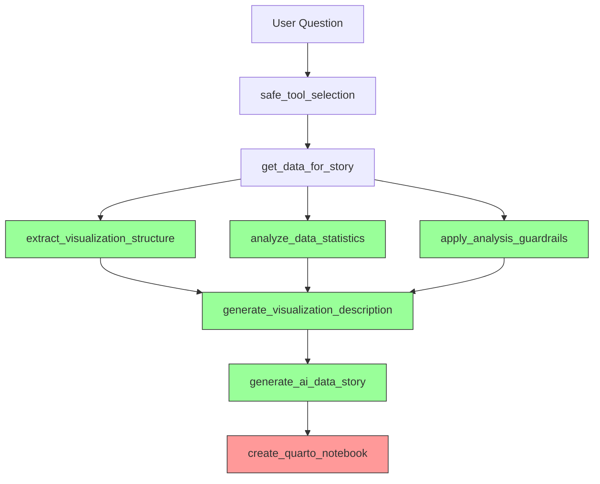

# UNHCR MCP Tool Orchestration Analysis

## Executive Summary

This document provides a comprehensive analysis of the current MCP (Model Context Protocol) tool orchestration within the UNHCR Statistics Copilot system. It identifies gaps in tool integration, particularly around the Quarto notebook generation pipeline, and proposes a refactored architecture for proper tool utilization.

## Current State Analysis

### 1. Available MCP Tools

The system currently exposes the following MCP tools through `backend/mcp/server.py`:

#### Data Retrieval Tools (Fully Integrated)
- ✅ `get_population_data` - Retrieve population statistics
- ✅ `get_demographics_data` - Retrieve demographic breakdowns
- ✅ `get_rsd_applications` - Retrieve asylum application data
- ✅ `get_rsd_decisions` - Retrieve asylum decision outcomes
- ✅ `get_solutions` - Retrieve durable solutions data
- ✅ `get_country_key_figures` - Retrieve country statistics
- ✅ `get_population_trends` - Retrieve time series data
- ✅ `retrieve_report_context` - Retrieve RAG context from reports

#### Reporting Pipeline Tools (Partially Integrated)
- ✅ `extract_visualization_structure` - Phase 1: Structure extraction
- ⚠️ `analyze_data_statistics` - Phase 2: Statistical analysis
- ⚠️ `generate_visualization_description` - Phase 3: Description generation
- ✅ `generate_ai_data_story` - Phase 4: Story generation
- ✅ `apply_analysis_guardrails` - Compliance validation
- ⚠️ `create_quarto_notebook` - Final export

#### Other Tools
- ✅ `get_data_for_story` - Data orchestration (INTEGRATOR)
- ✅ `generate_analytical_story` - Alternative story generation
- ✅ `safe_tool_selection` - Tool routing
- ✅ `get_usage_guidance` - User guidance
- ✅ `get_suggested_questions` - Query suggestions

### 2. Integration Status Matrix

| Tool | Direct MCP Access | Used in chat.py | Used in get_data_for_story | Used in create_quarto_notebook | Status |
|------|-------------------|----------------|----------------------------|-------------------------------|--------|
| extract_visualization_structure | ✅ | ❌ | ❌ | ❌ | **NOT USED** |
| analyze_data_statistics | ✅ | ❌ | ✅ (Partial) | ❌ | **UNDERUTILIZED** |
| generate_visualization_description | ✅ | ❌ | ❌ | ❌ | **NOT USED** |
| generate_ai_data_story | ✅ | ❌ | ❌ | ❌ | **UNDERUTILIZED** |
| apply_analysis_guardrails | ✅ | ❌ | ✅ (Partial) | ❌ | **UNDERUTILIZED** |
| create_quarto_notebook | ✅ | ✅ | ❌ | ✅ | **PARTIALLY USED** |
| get_data_for_story | ✅ | ✅ | N/A | ❌ | **INTEGRATOR** |
| generate_analytical_story | ✅ | ✅ | ❌ | ❌ | **PRIMARY** |

### 3. Current Data Flow



**Missing Connections:**
- ❌ `extract_visualization_structure` is NOT called anywhere
- ❌ `generate_visualization_description` is NOT called anywhere
- ❌ `generate_ai_data_story` is NOT called in the main flow (only via direct API)

### 4. Current Quarto Generation Flow

```
User Question
    ↓
[chat.py:process_question]
    ↓
safe_tool_selection → identifies tool sequence
    ↓
get_data_for_story → retrieves data + calls analyze_data_statistics & apply_analysis_guardrails
    ↓
generate_analytical_story → generates story content
    ↓
create_quarto_notebook → creates .qmd file
    ↓
Output: Quarto file with issues:
        - Indentation errors in code cells
        - Story content includes raw dict/JSON strings
        - Metadata visible in rendered output
```

## Identified Issues

### Issue 1: Indentation Errors in Generated Quarto Files

**Root Cause:** In `create_quarto_notebook.py`, the `_generate_data_visualization_code()` function generates Python code with proper indentation, but when inserted into the Jinja2 template at line 66-68 of `quarto_notebook.j2`, the code block indentation is not handled correctly.

**Evidence:** Generated file line 65-66 shows:
```python
```{python}
#| echo: false
import pandas as pd
```

The code is correctly indented, but the YAML header and the code block markers may have issues.

### Issue 2: Narrative Content Not Properly Extracted

**Root Cause:** In `chat.py` line 946, the story content is extracted as:
```python
story_content = story_response.get("story", "") if isinstance(story_response, dict) else str(story_response)
```

However, when the story comes from the LLM via `generate_analytical_story_tool`, it may be nested differently. In the generated file line 46, we see:
```
[{'id': 'msg_0452f3a8c15a2aca006a4bd7de32d0819683868baa4bce5253', 'type': 'message', ...}]
```

This is a raw message object, not the story text.

**Flow Analysis:**
```
chat.py:937 → calls generate_analytical_story
    ↓
generate_analytical_story.py:58 → calls backend.llm.generate_story_from_data
        ↓
    This returns a message object, not just the story text
    ↓
chat.py:946 → extracts story_response.get("story", "")
    ↓
But if the response is a message object list, str(story_response) is used
```

### Issue 3: Metadata Visible in Rendered Output

**Current State:** In `quarto_notebook.j2` lines 38-93, metadata is stored as HTML comments:
```html
<!-- Generated: {{ timestamp }} -->
<!-- Audience: {{ audience }} -->
```

HTML comments ARE rendered in the HTML output (visible in page source, though not displayed). The user wants metadata ONLY in the source .qmd file, not in the rendered HTML.

**Solution:** Move metadata to YAML header or use Quarto's native metadata fields.

### Issue 4: Tools Not Leveraged

The following tools are registered but NOT used in the Quarto generation pipeline:

1. **extract_visualization_structure** - Never called
2. **generate_visualization_description** - Never called
3. **analyze_data_statistics** - Only called in get_data_for_story, results not passed to Quarto
4. **apply_analysis_guardrails** - Only called in get_data_for_story, results not passed to Quarto
5. **generate_ai_data_story** - Only available via direct API endpoint, not in chat flow

## Proposed Refactored Architecture

### New Data Flow



### Integration Points

#### 1. Enhanced get_data_for_story
```python
async def get_data_for_story_tool(...):
    # Current: retrieves data + calls analyze_data_statistics & apply_analysis_guardrails
    
    # NEW: Also extract visualization structure
    structure = extract_visualization_structure_tool(
        visualization_type="line_chart",  # or auto-detect
        title=...,
        x_axis_label=...,  # from data analysis
        y_axis_label=...
    )
    
    # NEW: Generate visualization description
    description = await generate_visualization_description_tool(
        structure=structure,
        statistics=stats,
        focus_areas=["trends", "comparisons"]
    )
    
    return {
        ...existing fields...,
        "visualization_structure": structure,
        "visualization_description": description,
        "statistics": stats,
        "guardrails": guardrails
    }
```

#### 2. Enhanced generate_ai_data_story
```python
async def generate_ai_data_story_tool(...):
    # Current: Uses RAG or template
    
    # NEW: Integrate visualization description and statistics
    if visualization_description:
        context += f"\n\nVisualization: {visualization_description['description']}"
    if statistics:
        context += f"\n\nStatistics: {statistics}"
    
    # Use enhanced context for better story generation
```

#### 3. Enhanced create_quarto_notebook
```python
async def create_quarto_notebook_tool(...):
    # Current: Accepts story_content, data
    
    # NEW: Accept and use all intermediate results
    visualization_structure = metadata.get('visualization_structure')
    visualization_description = metadata.get('visualization_description')
    statistics = metadata.get('statistics')
    guardrails = metadata.get('guardrails')
    
    # Store metadata in YAML header (not HTML comments)
    yaml_header['metadata'] = {
        'analysis': {
            'structure': visualization_structure,
            'statistics': statistics,
            'guardrails': guardrails,
            'description': visualization_description
        },
        'audience': audience,
        'document_type': document_type
    }
    
    # Include visualization description in narrative
    if visualization_description:
        story_content = f"{visualization_description['description']}\n\n{story_content}"
```

### 3. Quarto Template Refactoring

**Current Issues in `quarto_notebook.j2`:**

1. Lines 65-68: Code block insertion needs proper indentation handling
2. Lines 38-93: Metadata as HTML comments (visible in rendered output)
3. Line 32-48: Story content handling doesn't account for raw dict objects

**Proposed Template Structure:**

```yaml
---
title: {{ title }}
author: {{ author }}
date: {{ date }}
format:
  html:
    embed-resources: true
    standalone: true
    
    theme: [unhcr, cosmo]
    css: unhcr.css
    
  pdf:
    documentclass: article
    papersize: a4
    geometry: [top=30mm, left=20mm, right=20mm, bottom=30mm]

# Custom metadata (only visible in source)
unhcr_metadata:
  generated: {{ timestamp }}
  
  audience: {{ audience }}
  
  
  document_type: {{ document_type }}
  
  
  analysis_config: {{ analysis_config | tojson }}
  
  
  tool_sequence: {{ metadata.tool_sequence | tojson }}
  original_query: {{ original_query | default('') | quote_yaml }}
  
  
# Statistics and analysis metadata
statistics: {{ metadata.get('statistics', {}) | tojson | default('') }}
guardrails: {{ metadata.get('guardrails', {}) | tojson | default('') }}
visualization: {{ metadata.get('visualization_structure', {}) | tojson | default('') }}

error: visual
engine: jupyter
---

# Metadata display in source only (using Quarto's cell options)
::: {.cell}
```{python}
#| echo: false
#| fold: true
# Metadata stored in YAML header - not displayed in rendered output
# Analysis ID: {{ metadata.get('analysis_id', 'N/A') }}
# Generated: {{ timestamp }}
print("Metadata loaded successfully")
```
:::

# {{ title }}

{{ story_content | escape_jinja | safe }}


::: {.cell}
```{python}
#| echo: false
#| fold: true
{{ python_code | indent(4, true) }}
```
:::

```

**Key Changes:**
- Move all metadata to YAML header (invisible in rendered output)
- Use Quarto's native cell options (`#| fold: true`) to hide metadata cells
- Use `| safe` filter for story content to preserve markdown formatting
- Use `| indent(4, true)` filter for Python code to ensure proper indentation
- Store complex metadata as JSON in YAML header

## Implementation Roadmap

### Phase 1: Fix Critical Bugs (Priority: HIGH)
1. Fix story content extraction in `chat.py` to handle message objects properly
2. Fix indentation in code cells in `create_quarto_notebook.py`
3. Move metadata from HTML comments to YAML header in template

### Phase 2: Integrate Unused Tools (Priority: HIGH)
1. Update `get_data_for_story.py` to call `extract_visualization_structure`
2. Update `get_data_for_story.py` to call `generate_visualization_description`
3. Pass all intermediate results through the pipeline to `create_quarto_notebook`

### Phase 3: Enhance Story Generation (Priority: MEDIUM)
1. Update `generate_analytical_story.py` to use visualization descriptions
2. Update `generate_analytical_story.py` to use statistics and guardrails
3. Ensure all tools are properly async/await compatible

### Phase 4: Testing & Validation (Priority: MEDIUM)
1. Create integration tests for the full pipeline
2. Validate all tool combinations
3. Test with various data types and question formats

## Specific Code Changes Required

### File: backend/mcp/tools/get_data_for_story.py

**Add:**
```python
# Extract visualization structure from data
from backend.mcp.tools.extract_visualization_structure import extract_visualization_structure_tool

# After data retrieval, extract structure
visualization_structure = extract_visualization_structure_tool(
    visualization_type="line_chart",  # Auto-detect based on data
    title=f"Analysis: {question}",
    x_axis_label="Year",  # Auto-detect from data
    y_axis_label="Count"   # Auto-detect from data
)

# Generate visualization description
from backend.mcp.tools.generate_visualization_description import generate_visualization_description_tool

visualization_description = await generate_visualization_description_tool(
    structure=visualization_structure,
    statistics=stats.get('statistics', {}),
    description_type="detailed",
    focus_areas=["trends", "comparisons", "outliers"]
)

return {
    ...existing fields...,
    "visualization_structure": visualization_structure,
    "visualization_description": visualization_description
}
```

### File: backend/mcp/tools/generate_analytical_story.py

**Update the template generation to use visualization data:**
```python
def _generate_section_content(self, section, ...):
    # Add visualization description to context
    if section == "introduction" and visualization_description:
        content_lines.append(visualization_description.get('description', ''))
    
    # Add statistics to key findings
    if section == "key findings" and statistics:
        # Format statistics as bullet points
        ...
```

### File: backend/mcp/tools/create_quarto_notebook.py

**Fix story content handling:**
```python
# In create_quarto_notebook_tool, ensure story_content is clean text
if isinstance(story_content, list):
    # Handle case where story is a list of message objects
    story_text_parts = []
    for item in story_content:
        if isinstance(item, dict):
            # Extract text from message object
            if 'content' in item and isinstance(item['content'], list):
                for content_item in item['content']:
                    if isinstance(content_item, dict) and 'text' in content_item:
                        story_text_parts.append(content_item['text'])
            elif 'text' in item:
                story_text_parts.append(item['text'])
        elif isinstance(item, str):
            story_text_parts.append(item)
    story_content = '\n'.join(story_text_parts)
elif isinstance(story_content, dict):
    # Extract story from dict
    story_content = story_content.get('story', story_content.get('content', str(story_content)))

# Ensure it's a string
story_content = str(story_content) if story_content is not None else ""

# Clean up any remaining JSON/dict artifacts
import re
story_content = re.sub(r"^\s*\[".*"\]\s*$", "", story_content, flags=re.DOTALL)
story_content = re.sub(r"^\s*\{".*"\}\s*$", "", story_content, flags=re.DOTALL)
```

**Fix code cell indentation:**
```python
def _generate_data_visualization_code(data, data_name="data"):
    # ... existing code ...
    
    # Ensure all lines are properly indented for Quarto code cells
    # Quarto code cells don't need extra indentation - the code goes directly in the cell
    return "\n".join(code_lines)  # No leading spaces needed
```

### File: backend/templates/quarto_notebook.j2

**Complete refactoring:**
```jinja2
---
title: {{ title|quote_yaml }}
author: {{ author|quote_yaml }}
date: {{ date|quote_yaml }}
format:
  html:
    embed-resources: true
    standalone: true
    
    theme:
      - unhcr
      - cosmo
    css: unhcr.css
    
    theme: cosmo
    
  pdf:
    documentclass: article
    papersize: a4
    geometry:
      - top=30mm
      - left=20mm
      - right=20mm
      - bottom=30mm

{# Store all metadata in YAML header - invisible in rendered output #}

unhcr_metadata:
  
audience: {{ metadata.audience|quote_yaml }}
  
  
document_type: {{ metadata.document_type|quote_yaml }}
  
  
  analysis_config: {{ metadata.analysis_config|tojson|quote_yaml }}
  
  
  tool_sequence: {{ metadata.tool_sequence|tojson|quote_yaml }}
  
  
  statistics: {{ metadata.statistics|tojson|quote_yaml }}
  
  
  guardrails: {{ metadata.guardrails|tojson|quote_yaml }}
  
  
  visualization_structure: {{ metadata.visualization_structure|tojson|quote_yaml }}
  
  
  visualization_description: {{ metadata.visualization_description|tojson|quote_yaml }}
  



original_query: {{ original_query|quote_yaml }}


generated: {{ timestamp|quote_yaml }}
source: UNHCR Statistics Copilot

error: visual
engine: jupyter
---

{# Metadata loading cell - hidden in rendered output #}
::: {.cell}
```{python}
#| echo: false
#| fold: true
# This cell loads and validates metadata
# All metadata is stored in the YAML header above
print("UNHCR Analysis Notebook")
print(f"Generated: {generated if 'generated' in globals() else 'N/A'}")
```
:::

{# Title and story content #}
# {{ title }}

{{ story_content | safe }}

{# Code cells - only output displayed, code hidden #}

::: {.cell}
```{python}
#| echo: false
# Data Analysis Code
{{ python_code | indent(4, first=False) }}
```
:::


{# Footer with audit trail - only in source #}
<!-- 
Document generated by UNHCR Statistics Copilot
Analysis based on official UNHCR data
AI-generated content - requires human validation
-->
```

## Validation Criteria

### For Issue Resolution
- [ ] Story content is clean markdown, no JSON/dict strings
- [ ] Python code in code cells has no indentation errors
- [ ] Metadata is NOT visible in rendered HTML (only in .qmd source)
- [ ] All MCP tools are called in the appropriate sequence

### For Tool Integration
- [ ] extract_visualization_structure is called for every analysis
- [ ] generate_visualization_description is called with structure and statistics
- [ ] analyze_data_statistics results are passed to story generation
- [ ] apply_analysis_guardrails results are passed to story generation
- [ ] All results are stored in Quarto YAML header

### For Output Quality
- [ ] Rendered HTML shows only code output, not code (echo: false)
- [ ] Code cells execute without syntax errors
- [ ] Story narrative flows logically with proper markdown formatting
- [ ] All visualizations render correctly

## Recommendations

1. **Immediate Fix:** Extract story text properly from message objects in chat.py
2. **Template Fix:** Move all metadata to YAML header in quarto_notebook.j2
3. **Integration:** Create a new orchestrator tool that properly sequences all analysis tools
4. **Testing:** Create a comprehensive test suite that validates the full pipeline
5. **Monitoring:** Add observability to track which tools are called and their success rates

## Appendix: Tool Signatures

### extract_visualization_structure_tool
```python
def extract_visualization_structure_tool(
    visualization_type: str,
    title: Optional[str] = None,
    subtitle: Optional[str] = None,
    x_axis_label: Optional[str] = None,
    y_axis_label: Optional[str] = None,
    x_axis_range: Optional[list[float]] = None,
    y_axis_range: Optional[list[float]] = None,
    legend_items: Optional[list[str]] = None,
    geometric_layers: Optional[list[str]] = None
) -> dict[str, Any]
```

### analyze_data_statistics_tool
```python
def analyze_data_statistics_tool(
    data: list[dict[str, Any]],
    numeric_columns: list[str],
    categorical_columns: Optional[list[str]] = None,
    correlation_columns: Optional[list[str]] = None
) -> dict[str, Any]
```

### generate_visualization_description_tool
```python
async def generate_visualization_description_tool(
    structure: dict[str, Any],
    statistics: dict[str, Any],
    description_type: str = "both",
    max_length: int = 300,
    focus_areas: Optional[list[str]] = None
) -> dict[str, Any]
```

### generate_ai_data_story_tool
```python
async def generate_ai_data_story_tool(
    rag_retriever: Any,
    visualization_data: dict[str, Any],
    context: Optional[str] = None,
    story_type: str = "analytical",
    max_tokens: int = 500,
    apply_guardrails: bool = True,
    use_report_context: bool = True,
    rag_top_k: int = 5,
    rag_fetch_k: int = 20,
    rag_rerank: bool = False,
    ...
) -> dict[str, Any]
```

### apply_analysis_guardrails_tool
```python
def apply_analysis_guardrails_tool(
    analysis_request: dict[str, Any],
    population_type: Optional[str] = None,
    country_iso: Optional[str] = None,
    year: Optional[str | int] = None,
    detailed_report: bool = False
) -> dict[str, Any]
```
